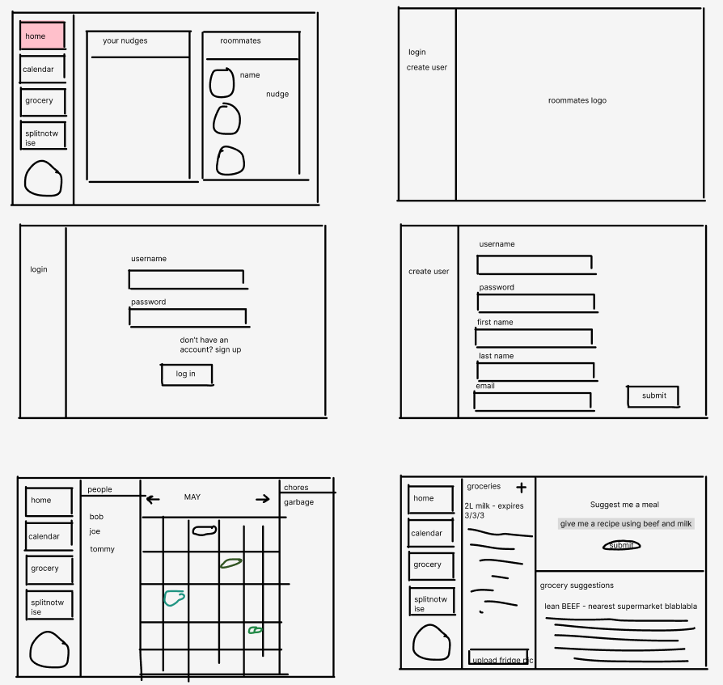

# Roommates

## Project Description
The Roommates app helps users track groceries and expiring food, meal plan based on groceries, and fairly divide up chores. Anyone looking for an easy, consolidated way to manage their household chores, whether living alone or with roommates/family, can use the Roommates app to get timely notifications on things like groceries running low or expiring, or chores that need to be done. The app stores data related to user profile information, households/groups, calendar details, and fridge contents. With this data, users will be able to create and manage their household/group and individual account, create and interact with events and chores in the calendar (including sending chore reminders to roommates), and add and remove fridge and grocery items. Some additional functionality may include a budgeting section (like splitwise) where users can divide expenses between members of their household, or AI image recognition for fridge items to help with the meal planning expiration tracking.

# Project task requirements
### Minimum Requirements
- Account creation and authentication
  - Create user login and signup page (front end)
  - Set up MongoDB connection in back end
  - Set up MongoDB collection for users
  - Enable OAuth in the back end for user verification
- Users can create a household (group), and add other users to this household
- Users can create a list to track food items and expiry dates in their household
  - Food items can be tagged for 'shared' or 'personal' use in this list
- Users can view a basic calendar implementation and create events (e.g. assigning chores to users)
  - Set up MongoDB collection for chores/events
  - Create front end for calendar + side navbar
  - Add functionality for adding an event/chore
  - Add functionality for assigning a user to a chore
### Standard Requirements 
- Users receive notifications for upcoming chores
- Users receive notifications for expiring food items (food item expiration dates are synced with the calendar)
- User preferences (e.g. turn off notifications)
- Users can ask AI to help with meal planning (e.g. suggest recipes using selected food items)
  - Users can save any recipes generated, see the list of all saved recipes, and remove any saved recipes
### Stretch Requirements
- AI image recognition for processing pictures of groceries and receipts to quickly add food items to the list
- Budgeting functionality (similar to Splitwise)
- Ability to “nudge” a roommate to complete a chore (similar to Facebook poking)

## Team Members
- Amy Chen: 4th year BCS student
- Jennifer Wong: 4th year BCS student with a black cat.
- Jocelyn Bachmann: 4th year BUCS student.
- Douglas Zhong: 4th Year BCS student, previously completed B.Sc in Microbiology and Immunology.

## Site Mockup

